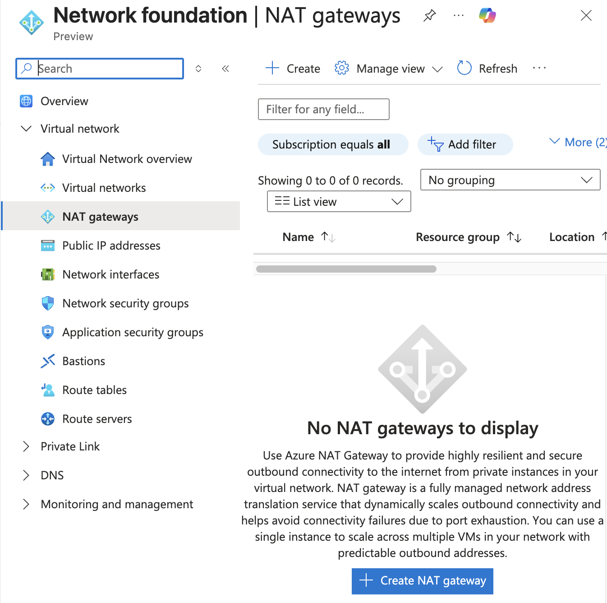
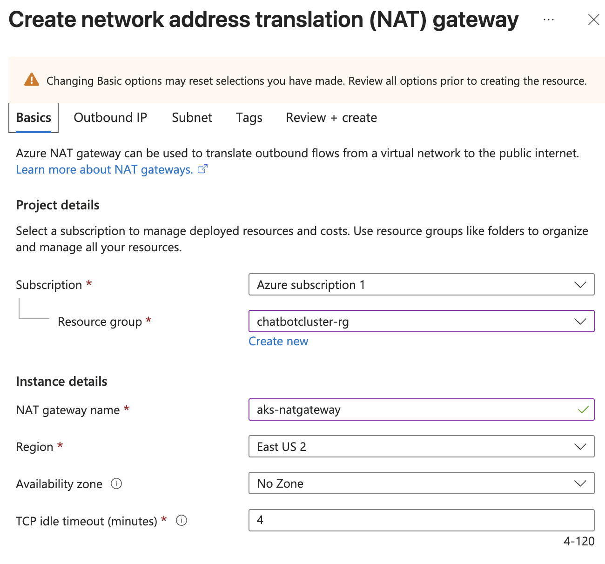

# DevSecOps: OpenAI Chatbot UI Deployment in EKS with Jenkins and Terraform


## **Introduction:**

In today’s digital world, user engagement is key to the success of any application. Implementing DevSecOps practices is essential for ensuring security, reliability, and efficient deployment processes. In this project, we aim to implement DevSecOps for deploying an OpenAI Chatbot UI. We will use Kubernetes (EKS) for container orchestration, Jenkins for Continuous Integration/Continuous Deployment (CI/CD), and Docker for containerization.

**What is ChatBOT?**

ChatBOT is an AI-powered conversational agent trained on extensive human conversation data. It utilizes natural language processing techniques to understand user queries and provide human-like responses. By simulating natural language interactions, ChatBOT enhances user engagement and provides personalized assistance to users.

**Why ChatBOT?**

**1\. Personalized Interactions:** ChatBOT enables personalized interactions by understanding user queries and responding in a conversational manner, fostering engagement and satisfaction.  
  
**2\. 24/7 Availability:** Unlike human agents, ChatBOT is available 24/7, ensuring instant responses to user queries and delivering a seamless user experience round the clock.  
  
**3\. Scalability:** With ChatBOT deployed in our application, we can efficiently handle a large volume of user interactions, ensuring scalability as our user base expands.

**How We’re Deploying ChatBOT?**

**1\. Containerization with Docker:** We’re containerizing the ChatBOT application using Docker, which provides lightweight, portable, and isolated environments for running applications. Docker enables consistent deployment across different environments, simplifying the deployment process and ensuring consistency.

**2\. Orchestration with Kubernetes (EKS):** Kubernetes provides powerful orchestration capabilities for managing containerized applications at scale. We’re leveraging Amazon Elastic Kubernetes Service (EKS) to deploy and manage our Docker containers efficiently. EKS automates container deployment, scaling, and management, ensuring high availability and resilience.

**3\. CI/CD with Jenkins:** Jenkins serves as our CI/CD tool for automating the deployment pipeline. We’ve configured Jenkins to continuously integrate code changes, run automated tests, and deploy the ChatBOT application to EKS. By automating the deployment process, Jenkins accelerates the delivery of updates and enhancements, improving efficiency and reliability.

**4\. DevSecOps Practices:** Throughout the deployment pipeline, we’re integrating security practices into every stage to ensure the security of our ChatBOT application. This includes vulnerability scanning, code analysis, and security testing to identify and mitigate potential security threats early in the development lifecycle.

By implementing DevSecOps practices and leveraging modern technologies like Kubernetes, Docker, and Jenkins, we’re ensuring the secure, scalable, and efficient deployment of ChatBOT, enhancing user engagement and satisfaction.

# **STEPS:**

**Step:1 :- Create Jenkins Server.**

1. Clone the GitHub repository.

**GITHUB REPO**: [Chatbot-UI](https://github.com/NotHarshhaa/DevOps-Projects/tree/master/DevOps-Project-28/Chatbot-UI)

```
git clone https://github.com/NotHarshhaa/DevOps-Projects/DevOps-Project-28/Chatbot-UI
```

2\. Before proceeding to next steps. Do the following things.

i. Ensure that you have a remote backend or use gitignore to ignore sensitive files 
ii. Ensure your project repository is well organized and done
v. Download/ensure you have the  Terraform, Kubernetes, Azure and AWS CLI installed.


```go
#Terraform Installation Script
wget -O- https://apt.releases.hashicorp.com/gpg | sudo gpg - dearmor -o /usr/share/keyrings/hashicorp-archive-keyring.gpg
echo "deb [signed-by=/usr/share/keyrings/hashicorp-archive-keyring.gpg] https://apt.releases.hashicorp.com $(lsb_release -cs) main" | sudo tee /etc/apt/sources.list.d/hashicorp.list
sudo apt update
sudo apt install terraform -y

#AWSCLI Installation Script
curl "https://awscli.amazonaws.com/awscli-exe-linux-x86_64.zip" -o "awscliv2.zip"
sudo apt install unzip -y
unzip awscliv2.zip
sudo ./aws/install
```

# Azure CLI Installation
Navigate to the link below to get install instructions per your operating system:
```
https://learn.microsoft.com/en-us/cli/azure/install-azure-cli-macos?view=azure-cli-latest
```

# Kubernetes Installation
Navigate to the page below to ensure you have kubectl installed if you don't already on your local machine:
```
https://kubernetes.io/docs/tasks/tools/
```


3\. **Configure AWS CLI:** Run the below command, and add your access keys.

```go
aws configure
```

4\. **Configure Azure CLI**: Use the command below to ensure that you are connected to a specific azure account via the CLI:
```
az login
```


5\. Initialize the backend for the EKS Cluster by running the below command.

```go
terraform init
```


6\. Run the below command to get the blueprint of what kind of AWS services will be created.

```go
terraform plan 
```


8\. Now, run the below command to create the infrastructure on AWS Cloud which will take 3 to 4 minutes maximum.

```go
terraform apply -var-file=variables.tfvars --auto-approve
```


**Step :2 :- Create Jenkins Pipeline**

1. Up to this Let’s create a pipeline and see if anything gone wrong.  
    Click on “New Item” and give it a name selecting pipeline and then ok.


2\. Under Pipeline section Provide

```go
Definition: Pipeline script from SCM
SCM : Git
Repo URL : Your Github Repo 
Credentials: Created GitHub Credentials
Branch: Main
Path: Your Jenkinsfile path in GitHub repo.
```


3\. Click on “Build”.

Upon successful execution you can see all stages as green.


Sonar- Console.


Dependency Check:


Trivy File scan:


Trivy Image Scan:


Docker Hub:


4\. Now access the application on port 3000 of Jenkins public ip.  
Note: Make sure you allowed port 3000 in Security Group of Jenkins Server.


5\. Click on openai.com(Blue in color)  
This will take you ChatGPT login page enter email and password.  
In API Keys Create Click on new secret key.


Give a name and copy it.


6\. Come back to chatbot UI that we deployed and bottom of the page you will see OpenAI API key and give the Generated key and click on save (RIGHT MARK).


UI look like:


7\. Now, You can ask questions and test it.


**Step:4 :- Create EKS Cluster withy Jenkins**

1. Click on New item give it a name by choosing pipeline and then click “OK”.


2\. Under Pipeline section provide:

```go
Definition: Pipeline script from SCM
SCM : Git
Repo URL : Your Github Repo 
Credentials: Created GitHub Credentials
Branch: Main
Path: Your EKS Cluster Jenkinsfile path in GitHub repo.
```


3\. Click on Build and on successful execution Your Jenkins UI resembles:


This will create a cluster in AWS:


4\. Now In the Jenkins server. Give this command to add context.

```go
aws eks update-kubeconfig --name <clustername> --region <region>
```

5\. It will Generate an Kubernetes configuration file.  
Navigate to the path of config file and copy it.

```go
cd .kube
cat config
```

6\. Save it in your local file explorer, at your desired location with any name as text file.


7\. Now in Jenkins Console add this file in Credentials section with id k8s as secret file.


**Step:5 :- Deployment on EKS**

1\. Now add this deployment stage in Jenkins file.

```go
stage('Deploy to kubernetes'){
            steps{
                withAWS(credentials: 'aws-key', region: 'us-east-1'){
                script{
                    withKubeConfig(caCertificate: '', clusterName: '', contextName: '', credentialsId: 'k8s', namespace: '', restrictKubeConfigAccess: false, serverUrl: '') {
                       sh 'kubectl apply -f k8s/chatbot-ui.yaml'
                  }
                }
            }
        }
     }
```

2\. Now rerun the Jenkins Pipeline again.

Upon Success:


This create all the resources in the Cluster:

```go
kubectl get all
```


This will create an Classic Load Balancer on AWS Console:


Copy the DNS Name and Paste it on your browser and use it:

Note: Do the same process and add key to get output.


The Complete Jenkins file:

```go
pipeline{
    agent any
    tools{
        jdk 'jdk17'
        nodejs 'node19'
    }
    environment {
        SCANNER_HOME=tool 'sonar-scanner'
    }
    stages {
        stage('Checkout from Git'){
            steps{
                git branch: 'master', url: 'https://github.com/NotHarshhaa/DevOps-Project-28/Chatbot-UI.git'
            }
        }
        stage('Install Dependencies') {
            steps {
                sh "npm install"
            }
        }
        stage("Sonarqube Analysis "){
            steps{
                withSonarQubeEnv('sonar-server') {
                    sh ''' $SCANNER_HOME/bin/sonar-scanner -Dsonar.projectName=Chatbot \
                    -Dsonar.projectKey=Chatbot '''
                }
            }
        }
        stage("quality gate"){
           steps {
                script {
                    waitForQualityGate abortPipeline: false, credentialsId: 'Sonar-token' 
                }
            } 
        }
        stage('OWASP FS SCAN') {
            steps {
                dependencyCheck additionalArguments: '--scan ./ --disableYarnAudit --disableNodeAudit', odcInstallation: 'DP-Check'
                dependencyCheckPublisher pattern: '**/dependency-check-report.xml'
            }
        }
        stage('TRIVY FS SCAN') {
            steps {
                sh "trivy fs . > trivyfs.json"
            }
        }
        stage("Docker Build & Push"){
            steps{
                script{
                   withDockerRegistry(credentialsId: 'docker', toolName: 'docker'){   
                       sh "docker build -t chatbot ."
                       sh "docker tag chatbot ProDevOpsGuyTech/chatbot:latest "
                       sh "docker push ProDevOpsGuyTech/chatbot:latest "
                    }
                }
            }
        }
        stage("TRIVY"){
            steps{
                sh "trivy image ProDevOpsGuyTech/chatbot:latest > trivy.json" 
            }
        }
        stage ("Remove container") {
            steps{
                sh "docker stop chatbot | true"
                sh "docker rm chatbot | true"
             }
        }
        stage('Deploy to container'){
            steps{
                sh 'docker run -d --name chatbot -p 3000:3000 sreedhar8897/chatbot:latest'
            }
        }
        stage('Deploy to kubernetes'){
            steps{
                withAWS(credentials: 'aws-key', region: 'us-east-1'){
                script{
                    withKubeConfig(caCertificate: '', clusterName: '', contextName: '', credentialsId: 'k8s', namespace: '', restrictKubeConfigAccess: false, serverUrl: '') {
                       sh 'kubectl apply -f k8s/chatbot-ui.yaml'
                  }
                }
            }
        }
      }
   }
}
```

**Step: 6 :- Virtual Network Connectivity Between Clusters**
FROM AWS:

FROM AZURE:
- I will create and attach a NAT Gateway to my nodes' subnets:




**Step: 7 :- Clean Up**

1. This is so simple Firstly Delete the EKS Cluster By selecting destroy as the build option.


2\. Then destroy Jenkins server by running this on Local:

```go
terraform destroy -auto-approve -var-file=variables.tfvars
```

---

## 🛠️ Author & Community  

This project is crafted by **[Harshhaa](https://github.com/NotHarshhaa)** 💡.  
I’d love to hear your feedback! Feel free to share your thoughts.  

📧 **Connect with me:**

- **GitHub**: [@NotHarshhaa](https://github.com/NotHarshhaa)
- **Blog**: [ProDevOpsGuy](https://blog.prodevopsguy.xyz)  
- **Telegram Community**: [Join Here](https://t.me/prodevopsguy)  

---

## ⭐ Support the Project  

If you found this helpful, consider **starring** ⭐ the repository and sharing it with your network! 🚀  

### 📢 Stay Connected  


