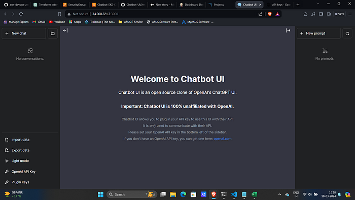

Hybrid Chatbot Platform – Multi-Cloud AI Architecture  

**AWS EKS | Azure AKS  | Kubernetes | Docker | Terraform |Next.js | OpenAI | CloudFront | Platform Architecture**


This repository delivers a **multi-cloud AI chatbot platform** that merges **DevSecOps principles** with **modern cloud-native architecture**.  
Co-engineered by **[Dennis]([https://github.com/NotHarshhaa](https://github.com/dteimuno))** (Azure / AKS) and **[David](https://github.com/dhayv)** (AWS / CloudFront / EKS), the system unifies containerized workloads, Terraform-based infrastructure, and cross-cloud failover through AWS CloudFront.

## 🧭 System Overview  

| Plane | Responsibility | Technology |
|-------|----------------|-------------|
| **Workload Plane** | Chatbot runtime (FastAPI + OpenAI) served through a Next.js 13 front-end | `Chatbot-UI/` |
| **Control Plane** | Declarative provisioning of EKS and AKS clusters via Terraform | `EKS-Cluster/`, `AKS-Cluster/` |
| **Edge Plane** | Global routing, caching, and failover via **AWS CloudFront** | `CloudFront/` |

Each layer is isolated, reproducible, and managed declaratively.

## ⚙️ Core Architecture  

- **Frontend Application** – Next.js 13 + TypeScript UI integrating OpenAI GPT with 15-language support and streaming responses.  
- **Infrastructure-as-Code** – Terraform modules provisioning isolated VPCs, NAT Gateways, and IAM/RBAC policies for both clouds.  
- **Kubernetes Deployment** – Unified manifests for EKS and AKS, including Services, Ingress, and health endpoints.  
- **Hybrid Connectivity** – Secure VPC Peering + VPN for cross-cluster communication.  
- **Edge Layer** – AWS CloudFront multi-origin routing providing active-passive failover and global content distribution.


---

## 🌐 CloudFront Multi-Cloud Failover (AWS ⇢ Azure)

We implemented an **Amazon CloudFront distribution** that fronts both clusters and provides **automatic failover**:

**Primary origin:** AWS EKS Service (public ELB DNS)  
**Secondary origin:** Azure AKS Service (public IP with DNS label `*.cloudapp.azure.com`)  
**Failover logic:** CloudFront serves EKS by default and automatically routes to AKS on **5xx** or failed health checks (`/healthz` returns 200).  
**Viewer endpoint:** default `*.cloudfront.net` domain — no custom DNS required.  
**Protocol to origin:** HTTP on port 80 (services listen on port 80).  

> Purpose: A single, resilient entry point with cross-cloud availability using existing public load balancers — no Route 53, no extra DNS cost.

**How it works**

1. Client hits `https://<cloudfront-id>.cloudfront.net`.  
2. CloudFront checks `/healthz` on the primary (EKS).  
   - Healthy → serves EKS.  
   - Unhealthy → fails over automatically to AKS.  
3. When EKS recovers, traffic resumes to EKS.

A validated failover path between AWS EKS (primary) and Azure AKS (secondary) through CloudFront — proving true multi-cloud high availability with zero DNS complexity.

**How We’re Deploying ChatBOT?**

**1\. Containerization with Docker:** We’re containerizing the ChatBOT application using Docker, which provides lightweight, portable, and isolated environments for running applications. Docker enables consistent deployment across different environments, simplifying the deployment process and ensuring consistency.

**2\. Orchestration with Kubernetes (EKS):** Kubernetes provides powerful orchestration capabilities for managing containerized applications at scale. We’re leveraging Amazon Elastic Kubernetes Service (EKS) to deploy and manage our Docker containers efficiently. EKS automates container deployment, scaling, and management, ensuring high availability and resilience.


# **STEPS:**
**Step: 1 :- Provisioning AKS cluster**
- We navigated to the AKS cluster folder and then after setting up our credentials to connect to AKS run the command:

```
cd AKS-Cluster
terraform apply -auto-approve
az login
az account set --subscription <YourSubscriptionID>
az aks get-credentials --resource-group <ResourceGroupName> --name <AKSClusterName>
```

**Step: 2 :- Deploying Chatbot UI in AKS Cluster **
- To deploy the cluster in my AKS cluster I used the commands:

```
cd ../Chatbot-UI/k8s
kubectl apply -f chatbot-ui.yaml
kubectl apply -f modified-aks-svc.yaml
```

**Step: 3 :- Provisioning EKS cluster**
- We navigated to the EKS cluster folder and then after setting up our credentials to connect to EKS run the command:

```
cd ../../EKS-Cluster
export AWS_ACCESS_KEY_ID=<your-aws-access-key>
export AWS_SECRET_ACCESS_KEY=<your-aws-secret-access-key>
terraform apply -auto-approve

```

**Step: 4 :- Deploying Chatbot UI in EKS Cluster **
- To deploy the cluster in my EKS cluster I used the commands:

```
kubectl config use-context <eks-cluster-name>
cd ../Chatbot-UI
kubectl apply -f chatbot-ui.yaml
kubectl apply -f modified-aks-svc.yaml
```

**Step: 5 :- Viewing Application via Internet for Both AKS and EKS Deployed Chatbot Application**
- Our application is being exposed via a loadbalancer service. To grab the address for the application, in both clusters we will use the command:

```
kubectl get svc 
```
 and then copy and paste the external address into a web browser. Our page should look something like this:




**Step: 6 :- Configuring Multi-Cloud Caching in AWS Cloudfront:**

This section validates true cloud-agnostic HA using only managed services, no DNS or third-party routing tools.

### CloudFront → Create Distribution

#### Origins
- **eks-primary**
  - **Origin domain:** `<your-eks-elb>.elb.amazonaws.com`
  - **Protocol to origin:** `HTTP only`
  - **Port:** `80`
- **aks-secondary**
  - **Origin domain:** `myaks-<region>.cloudapp.azure.com`
  - **Protocol to origin:** `HTTP only`
  - **Port:** `80`

#### Origin Group (Failover)
- **Primary:** `eks-primary`
- **Secondary:** `aks-secondary`
- **Failover criteria:** `HTTP 500–599`
- **Health check path:** `/healthz`

#### Default Behavior
- **Viewer protocol policy:** `Redirect HTTP to HTTPS`
- **Allowed methods:** `GET, HEAD, OPTIONS, PUT, POST, PATCH, DELETE` (for APIs)
- **Cache policy:** `Managed – CachingDisabled`
- **Origin request policy:** `Managed – AllViewer`

#### Domain / Certificate
- Leave **Custom domain** empty
- Use default `*.cloudfront.net` certificate

> **Notes**
> - In Azure, assign a **DNS label** to the Service public IP (gives `*.cloudapp.azure.com`).
> - Ensure neither EKS nor AKS Services block CloudFront during setup  
>   (avoid restrictive `loadBalancerSourceRanges`).
> - For security, use **AWS WAF** at CloudFront instead of IP allow-listing.

---

## ✅ Verifying

### Direct Origins (Bypass CloudFront)
```bash
curl -I http://<your-eks-elb>.elb.amazonaws.com/healthz
curl -I http://myaks-<region>.cloudapp.azure.com/healthz
# Expect: HTTP/1.1 200 OK from both
```

 
**Step 7 Verify failover** 

`curl` tests (Scale EKS → 0) | CloudFront |

**Step 8 Clean up resources** 

terraform destroy` for each cluster

```bash
terraform destroy -auto-approve -var-file=variables.tfvars
```

---

## 🧱 Tech Stack  

**Frontend:** Next.js 13, React 18, TypeScript, Tailwind CSS, OpenAI API  
**Infrastructure:** Terraform, Docker, Kubernetes (EKS / AKS)  
**Edge & Security:** AWS IAM, Azure RBAC, VPC, NAT Gateway, CloudFront  

---

## 👥 Contributors  

- **David Hayv** — AWS EKS, CloudFront, Terraform, Cross-Cloud Architecture  
- **Dennis Teimuno** — Azure AKS, RBAC, Networking, Terraform Modules  

---

## 📚 Acknowledgment  

Forked and extended from [@NotHarshhaa](https://github.com/NotHarshhaa).  
This version adds **multi-cloud deployment, CloudFront failover, and security enhancements** while retaining the educational foundation of the original.

---

## 📌 Takeaway  

This project proves that a two-engineer team can design and validate **enterprise-grade multi-cloud resilience** using standard DevSecOps tooling —  
no vendor lock-in, no proprietary gateways.  

**Governed · Scalable · Declarative · Cross-Cloud by Design.**

